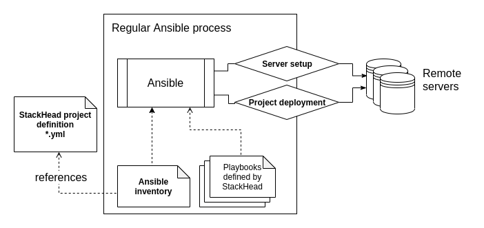

# Workflow

StackHead utilizes Ansible and Terraform to set up your projects.

The figure above illustrates the general StackHead workflow. StackHead provides custom Ansible playbooks for installing required software on a remote server \(setup\) and configuring your projects \(deployment\).

The highlighted terms are explained in further detail below.

## Project definition

A web project usually includes an application and additional components \(runtime environment, databases, etc\). Also it is usually served on a Top Level Domain by some kind of webserver.

This information is stored inside a [**project definition** file](project-definition.md).

Based on the project definition file, StackHead will take care setting up the required configuration. It will start up the specified Docker containers and set up the required web server configuration.

## Server setup

During server setup all software and utilities that are required to set up your projects with StackHead are installed. Such may include Terraform, container management software \(e.g. Docker\) and web server software \(e.g. Nginx\). You'll have to run the server setup before you can deploy projects onto it.

The server setup is executed by running the respective Ansible playbook.

## Project deployment

Setting up a project is called deployment and is done by running the respective Ansible playbook. This will create all project-related resources such as web server configuration, SSL certificates and start up containers.


Only servers that have been set up using the StackHead **server setup** can be deployed onto!


## Resource management

StackHead uses Terraform for creating resources of any kind. Such include configuration files, SSL certificates and Docker containers.

While understanding how we use Terraform is not required for using StackHead, you can find out more in the [technical documentation](../technical-documentation/terraform.md) if you are interested.

