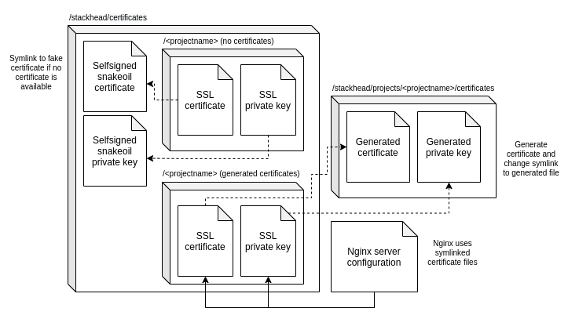

# SSL certificates

SSL certificates are generated before the Nginx server is reloaded. Since we require a Nginx configuration in order to be able to create SSL certificates, a self-signed certificate \(snakeoil\) is used until the real certificates are ready.

The figure above shows the organisation of SSL certificates and how they are used by Nginx.

## Snakeoil certificate

The **snakeoil certificate** is created via Ansible during server setup. It is a selfsigned certificate that technically expires after 100 years after creation, i.e. never. \(If it really expires simply run the server setup again.\)

The certificate and corresponding private key is stored inside the `/stackhead/certificates` directory.

Freshly generated Nginx configurations will have a certificate paths that are symlinked to these snakeoil files, enabling Nginx to start.

## Project certificates

Project certificates are [generated via Terraform](terraform.md) after the Nginx server configuration is written and active. They are stored inside the `certificates` folder of the project directory \(i.e. `/stackhead/projects/<project_name>/certificates`\).

After creation, the symlinked path to the certificate used by Nginx is switched to the generated certificate \(and private key\) and the Nginx configuration is reloaded.

