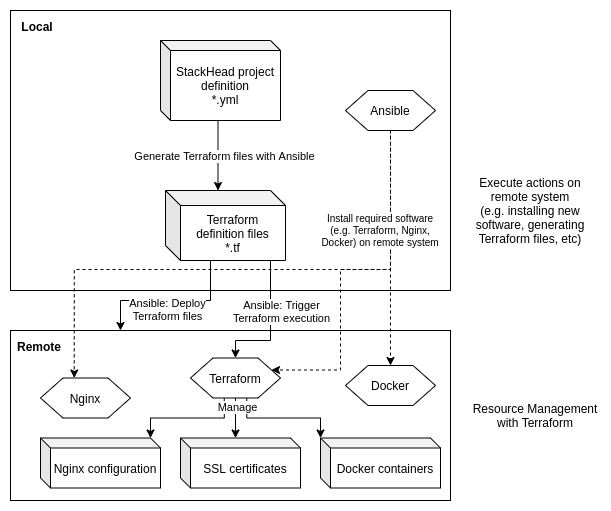
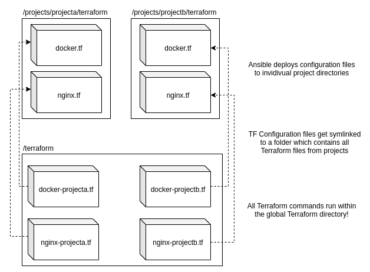

# Terraform

[Terraform](https://www.terraform.io/) is a tool for provisioning and managing server resources.

StackHead installs Terraform during **server setup** and uses it during **project deployment** for managing resources.

The Terraform configuration files are generated based in the project definition. The aim is to use Terraform for all resources we need to create in order to allow state-like resource management.

## Resources managed by Terraform

Right now the following resources are being created with Terraform:

* Nginx server block configurations
* Docker containers
* SSL certificates

## Terraform execution

Each project's Terraform configuration files are placed in the `terraform` folder of the project directory \(e.g. `/stackhead/projects/my_project/terraform`\).

The Terraform configuration files from all project directories are symlinked into a general Terraform folder \(as seen below\). With that Terraform is able to manage resources for all projects simultaneously.

Each deployment will remove existing Symlinks in the global Terraform directory and relink those that are currently in the project's Terraform directory. The files in the global Terraform directory will have the format `[projectname]-[originalname].tf`.


Symlinks are usually regenerated at the end of the deployment.


